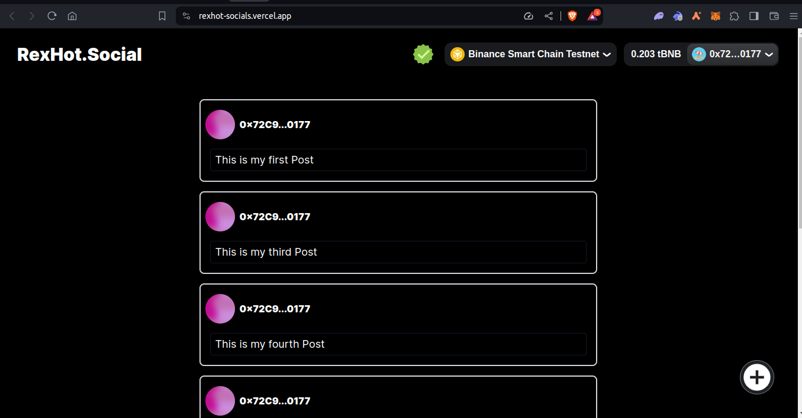
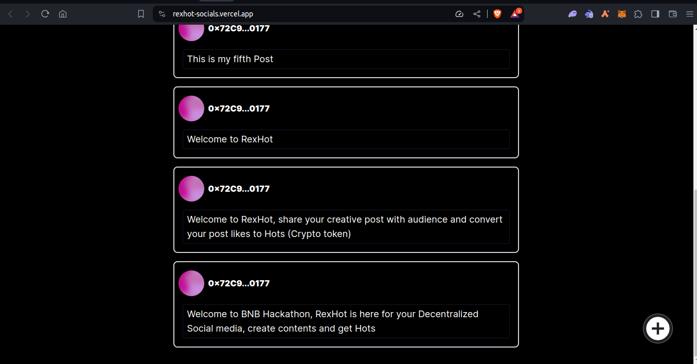
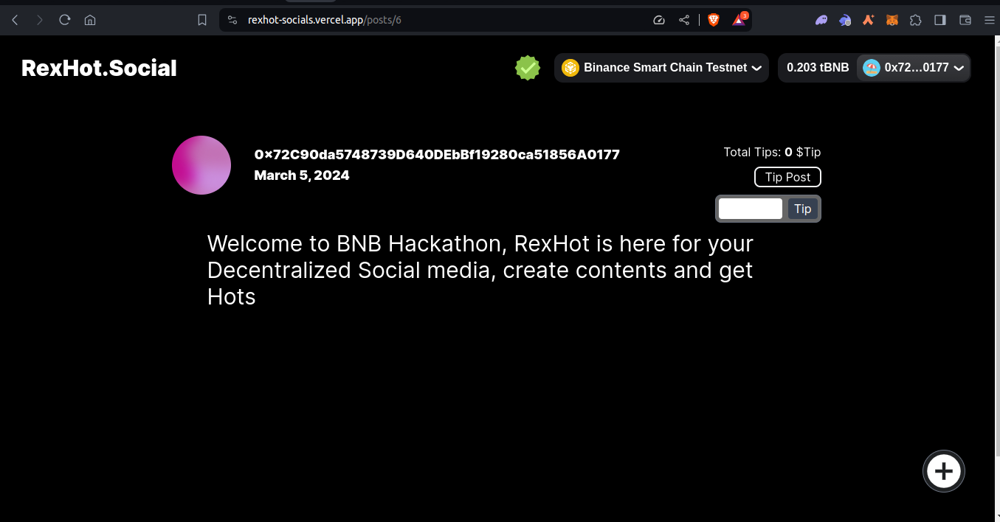

# RexHot Social

RexHot Social is a decentralized social media platform that allows users to create contents or post and turns the likes or Loves on those post to Hot (Crypto token).
Hot is the crypto token of the RexHot ecosystem.
Users or creators who got hot from fans for their post can easily redeemed the host by using it to buy any product, item or service from the RexHot MarketPlace.

RexHot Social's vision is to create a decentralized social media landscape where users have complete control over their content and interactions, free from the restrictions and limitations imposed by centralized platforms. It aims to foster a community where creativity is rewarded, and users are incentivized to contribute and engage through the unique Hot token. This platform seeks to democratize the internet, giving users the power to own their data, content, and social interactions, while also providing a new avenue for creators to monetize their work.

By integrating blockchain technology, RexHot Social ensures transparency, security, and censorship-resistance, providing a platform where users can freely express themselves without the fear of censorship or data manipulation. This decentralized approach not only enhances user privacy and security but also opens up new possibilities for social interaction and content creation, making it a pioneering solution in the digital age.

## Contract Addresses

- RexHotToken:

0x9Ae9395DC0861735891e5fAF752999172093d65e

- RexHot Social:

0x1270Ae31d234C0130D965924d75fB7294706CC79

https://testnet.bscscan.com/address/0x1270Ae31d234C0130D965924d75fB7294706CC79#code

## Live URL

https://rexhot-socials.vercel.app/

- 

- 

- 
